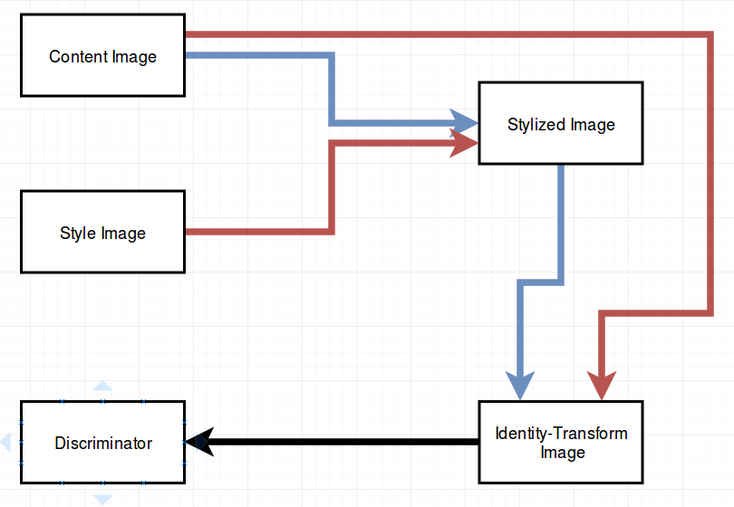
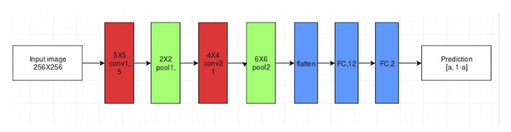

# *Cloud MoNet*: An Adversarial Approach to Robust Unobserved Neural Style Transfer

By [Akhil Jalan](https://github.com/akhiljalan/) and [Noah Wu](https://github.com/N0ahW).

See `cloud_monet_final_paper.pdf` for our final report. 

See `cloud_monet_final_poster.pdf` for a high-level overview of our problem. Note that the poster does not contain all of our results, which are in the paper. 

## Guide to this Repo

The `doc/` folder contains some of the articles that we collected during research. We especially recommend `doc/Exploring the structure of a real-time, arbitrary neural artistic stylization network.pdf`, which is the source of our baseline model. 

The `gan/` folder contains the code that we wrote for our GAN model. Here is a schematic of our setup. 

The `discriminator/` folder contains deprecated code. To see the discriminator used the final model, see `gan/true_gan.py`. It is a simple CNN, with the following architecture.

## Reproducibility

### Python Environment

We used the Magenta environment created by Google. If you're using Python 2.7 and Tensorflow 1.7, you should be able to run our code. But for full reproducibility, we suggest using their environment, which you can install from the instructions at: https://github.com/tensorflow/magenta#installation

### Datasets

For content images, we used Microsoft COCO. 
COCO:  (2017 Test Images)
http://cocodataset.org/#download

For style images, we used Kaggle's Painters by Numbers. 
Painters by Numbers: (Train Folder 1 (train_1.zip))
https://www.kaggle.com/c/painter-by-numbers/data

### Hyperparameters 

